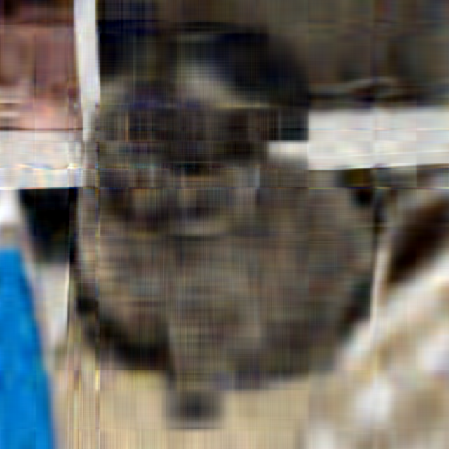
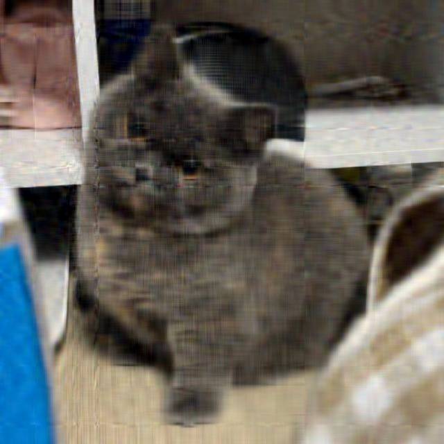
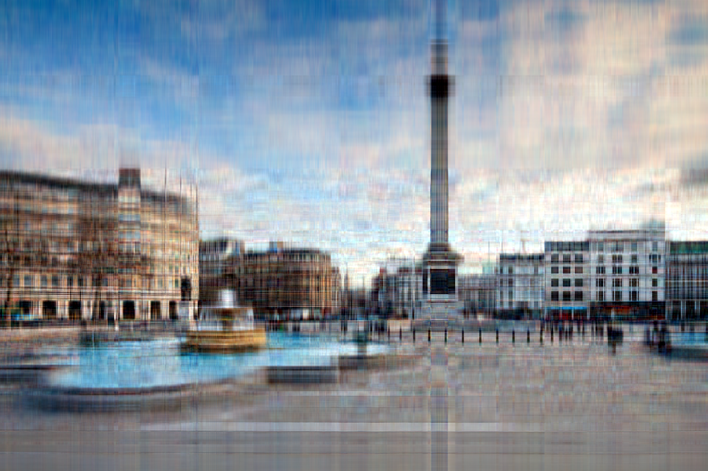
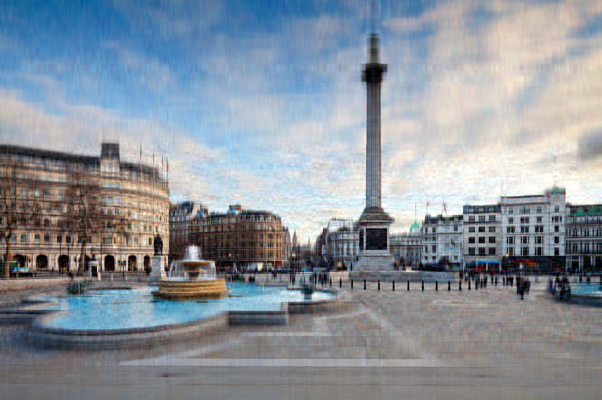

# Различные способы сжатия bmp-изображения
Реализовано три способа сжатия:
- `--standard` -- библиотека NumPy;  
- `--primitive` -- степенной метод;  
- `--advanced` -- блочный степенного метод.  

# Эксперимент

Для сравнения сжатия были выбраны 3 фотографии:
- кот, подходящий для того, чтобы поставить его на аватарку в ТГ
- фотография улицы Лондона с людьми
- красочная фотография космоса (хз кто фоткал)

# Cat
| source | standard | primitive | advanced |
| -------|-------|-----------|----------|
|  |  |  |  |

Между `primitive` и `advanced` заметной разницы нет, однако способ из numpy заметно уступает двум другим. Глаза уже сливаются с головой, границы корпуса кота размыты.

# London, space

| source | standard | primitive | advanced |
| -------|-------|-----------|----------|
|  |  |  |  |

| source | standard | primitive | advanced |
| -------|-------|-----------|----------|
|  |  |  |  |

Аналогично фотографии с котом, стандартный способ уступает примитивному и "продвинутому". В случае с фотографиями, обработанными библиотекой numpy, больше вещей сливаются: не видно падающей воды, люди неразличимы, от флагов остаются лишь палки. У `primitive` и `advanced` есть отличие отличие, которое опишется в следующем пункте.

# Итого
Из сравнения трех способов сжатия фотографий можно сделать выводы:
- стандартный способ сжатия уступает по качеству, но выигрывает по времени (примерно полсекунды на фотографию весом 3мб);
- `primitive` и `advanced` неотличимы в результате сжатия, но время обработки разное: ~минута для степенного метода и ~4 секунды для блочного степенного метода (фото 3мб);
- если крайне важна скорость и допустимы просадки качества сжатия - `standard`; и рыбку съесть, и в воду не лезть - `advanced`; делается кофе - `primitive`.
